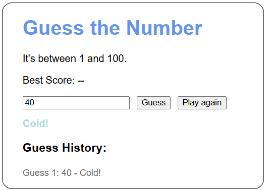
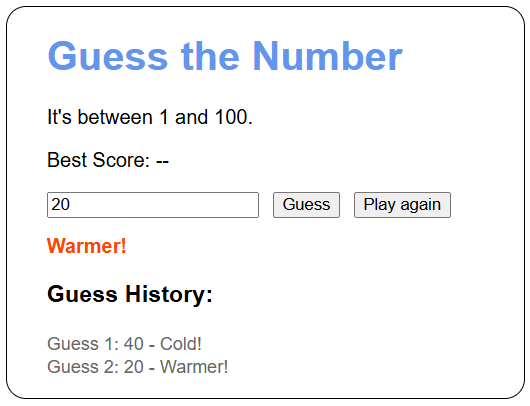

# 📱Game Description    
> *This game generates a random number from 1-100 that the player must guess! As the player gets closer to the number, the message under the guess-box will change as well as the color of the letters!🤩*
> - *The further the player is from the number, the colder they will be🥶.*
> - *The closer to the number, the hotter!🔥* 

```How To Play:```
Step | Action
------------- | -------------
1.) Enter 1-100  | Enter Number Within 1-100!

2.) Press Enter  | Observe the message!

3.) Guess Again | Repeat!

4.) Guess Correctly! | Play Again!

  
## ℹ️Important Validation Checks!
Validation Check | Description
------------- | -------------
1.) Is a Number?  | Checks if the player's input is a number. If not, they get alerted.
2.) Is within range | Checks if player's input is within 1-100. If not, they get alerted.


## 📚Authors
👨‍🎓 **Rafael Negrete Fonseca**  
- **GitHub Profile**: [rnegrete01](https://github.com/rnegrete01)  
  


